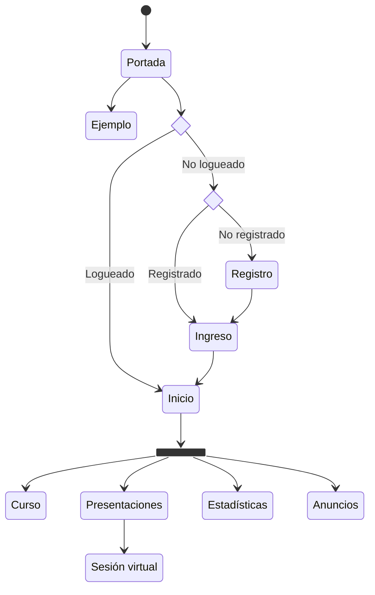

# Desarrollo del software

## Tecnologías

### Backend: Django

[Django](https://www.djangoproject.com/) es un *framework* de desarrollo web basado en Python.

### Frontend: Reveal.js

[Reveal.js](https://revealjs.com/) es un *framework* de presentaciones HTML.

## Metodología de desarrollo

El proyecto cuenta con la asistencia de una persona de ingeniería de software de la Escuela de Ciencias de la Computación e Informática

## Documentación

## Mapa del sitio

- Portada: Bienvenida e información general del sitio
- Ejemplo: Presentación de ejemplo del sistema para usuarios no registrados
- Registro: Para nuevos usuarios
- Ingreso: Para usuarios registrados
- Inicio: Página de inicio del usuario registrado
- Curso: Material complementario del curso
- Presentaciones: Lista de presentaciones asincrónicas disponibles e ingreso a la siguiente presentación sincrónica
  - Sesión: Presentación para las clases virtual del curso
- Estadísticas: Resumen de estadísticas individuales y colectivas de uso, incluyendo las evaluaciones en las presentaciones
- Anuncios: Información relevante sobre eventos próximos o recientes

