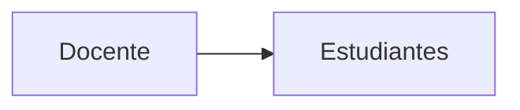
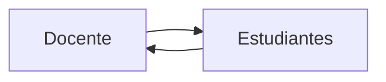
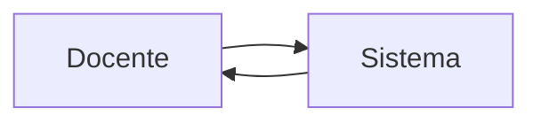
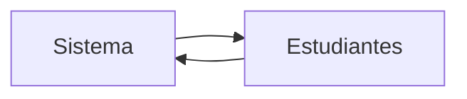
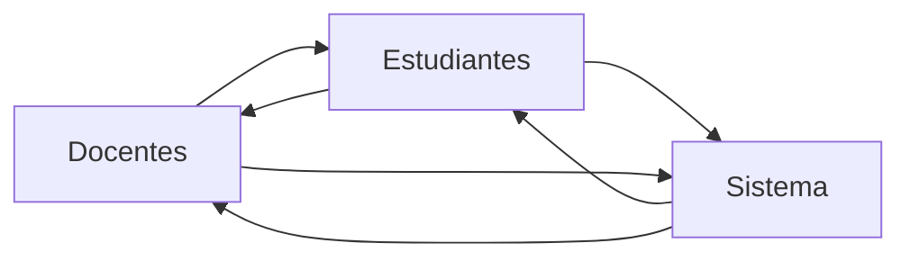

# Justificación del sistema

**Fabián Abarca Calderón**  
*Escuela de Ingeniería Eléctrica*  
*Universidad de Costa Rica*  

> Este desarrollo es parte de un proyecto inscrito en la Vicerrectoría de Docencia de la Universidad de Costa Rica llamado PD-IE-472-2022 "Estrategias docentes para sesiones virtuales interactivas con el desarrollo de un nuevo sistema web: una experiencia en el curso Modelos Probabilísticos de Señales y Sistemas".

Su **objetivo general** es diseñar e implementar un sistema web de presentación de contenidos e interacción entre profesores y estudiantes para sesiones virtuales, dedicado a la enseñanza y aprendizaje de conceptos de probabilidad y estadística para ingeniería eléctrica.

## Descripción del sistema

La siguiente clasificación particular (de elaboración propia) es hecha según los flujos de información y se compone de tres elementos (o "actores"): docente, estudiantes y el "sistema", entendido como una instancia o simulación del objeto de estudio que generalmente será algún tipo de contenido interactivo. En este curso, un ejemplo del "sistema" es la ejecución y visualización de programas de análisis de datos en Python.

1. **Presentar**: información del docente hacia las y los estudiantes.

Ejemplo en el curso: presentación con diapositivas puede incluir la ayuda de material multimedia)

*Diagrama de flujo unidireccional de información:*

2. **Dialogar**: información hacia y desde la o el docente y las y los estudiantes.

Ejemplo en el curso: generalmente utilizando videoconferencia.

*Flujo bidireccional de información:*

3. **Demostrar**: información hacia y desde la o el docente y el sistema, donde las y los estudiantes son observadores.

Ejempli en el curso: generalmente utilizando pantalla compartida, o "screencasting".

*Flujo bidireccional de información:*

4. **Experimentar**: información hacia y desde el sistema y las y los estudiantes.

Ejemplos en el curso: las y los estudiantes manipulan los parámetros de una simulación aleatoria y ven sus resultados.

*Flujo bidireccional de información:*

5. **Colaborar**: información hacia y desde la o el docente, las y los estudiantes y el sistema.

Ejemplo en el curso: docente y estudiantes participación de la creación de una solución programada para un problema de probabilidad.

*Flujo multidireccional de información:*

### Clasificación de sistemas existentes

En este marco de clasificación de interacciones, es posible clasificar los sistemas más conocidos para hacer presentaciones web multimedia.
